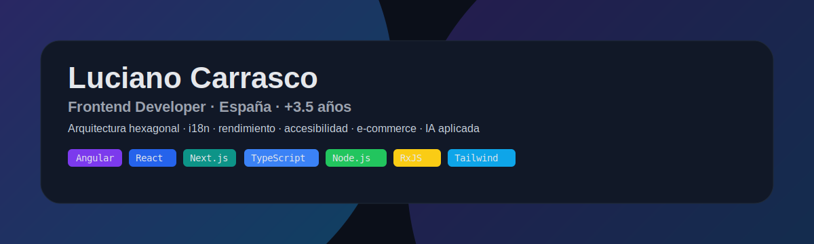

  

# 👋 ¡Hola! Soy Luciano Carrasco

🧑‍💻 **Frontend Developer** con +3.5 años de experiencia  
🇪🇸 Viviendo en España | 🌍 Abierto a oportunidades globales  

 
  

---

## 🛠️ Stack principal  

---

## 📈 GitHub Stats  

  

---

## 🚀 Experiencia Destacada  

- ⚡ Optimización de rendimiento con SSR, SSG e ISR en **Next.js**.  
- ♿ Integraciones de **IA para accesibilidad** (auto-descripción de vídeos con Gemini).  
- 🛒 Desarrollo de features clave en e-commerce: carritos, pagos, notificaciones.  
- 🌍 **Internacionalización (i18n)** para plataformas multi-mercado en Europa.  
- 🏗️ Uso de **arquitectura hexagonal, microfrontends y principios SOLID** para escalar proyectos.  

**Clientes/Proyectos:** Rentbuzz, Diverger Thinking, Grupo XtraAuto, Multiglobal.  

---

## 📌 Proyectos destacados  

🔗 [**Portfolio Personal**](https://lucianocarrasco.netlify.app/) – Muestra de mis trabajos y experimentos.  
🔗 [**Rentbuzz (demo)**](#) – Plataforma de alquiler de coches con Next.js 15, Zustand e i18n.  
🔗 [**E-commerce Template**](#) – Carrito, filtros y gestión de pedidos con React + Redux.  

---

## 💬 Sobre mí  

Soy un desarrollador frontend apasionado por crear interfaces **rápidas, accesibles y escalables**.  
Trabajo con foco en rendimiento, accesibilidad y buenas prácticas de arquitectura.  

> 🎤 *"En los momentos de crisis, sólo la imaginación es más importante que el conocimiento." -Albert Einstein.*  

---

✨ Si querés charlar sobre arquitectura, accesibilidad o invitarme un café virtual → ¡escribeme! 🍻
